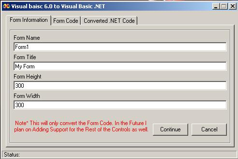



## Vb to \.Net Conversion Tool

### Description

This will convert your VB6 Code to .NET code, Currently it only supports conversion of the Form Code. Soon I will add support for the Other windows Controls also.
 
### More Info
 

             |
---                |---
**Submitted On**   |2002-12-26 21:46:18
**By**             |[PFCGentry](https://github.com/Planet-Source-Code/PSCIndex/blob/master/ByAuthor/pfcgentry.md)
**Level**          |Intermediate
**User Rating**    |5.0 (20 globes from 4 users)
**Compatibility**  |VB 6\.0
**Category**       |[Miscellaneous](https://github.com/Planet-Source-Code/PSCIndex/blob/master/ByCategory/miscellaneous__1-1.md)
**World**          |[Visual Basic](https://github.com/Planet-Source-Code/PSCIndex/blob/master/ByWorld/visual-basic.md)
**Archive File**   |[Vb\_to\_\_Net15189812262002\.zip](https://github.com/Planet-Source-Code/pfcgentry-vb-to-net-conversion-tool__1-41884/archive/master.zip)

